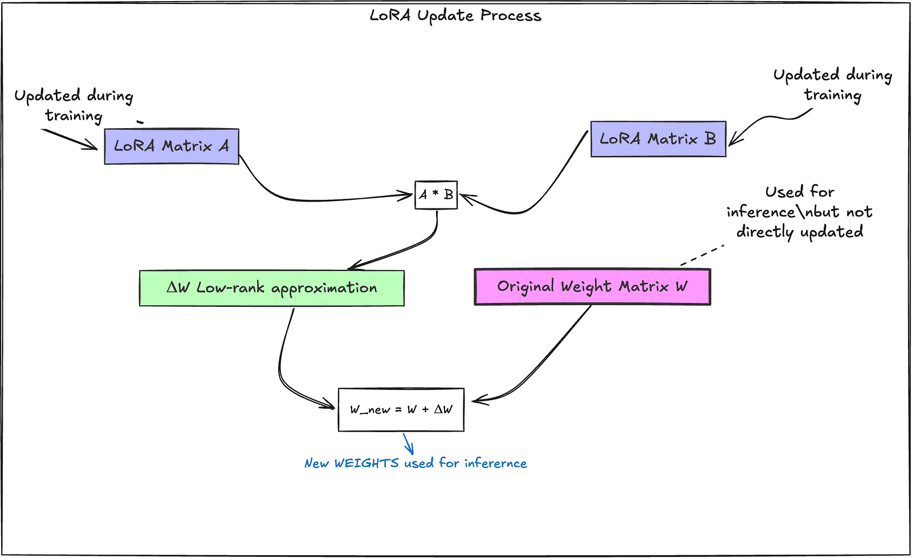
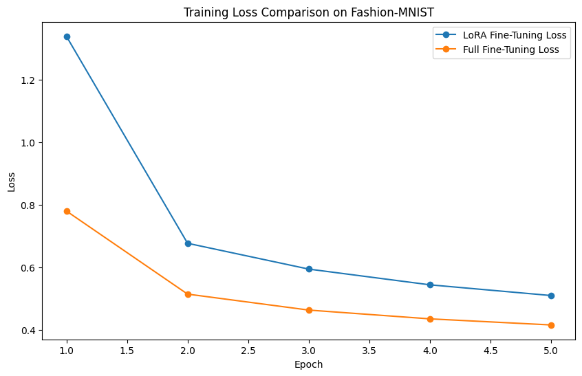

# Efficient Model Adaptation with LoRA: From MNIST to Fashion-MNIST

Using **Low-Rank Adaptation (LoRA)** to efficiently fine-tune a neural network from the MNIST dataset to the Fashion-MNIST dataset using a simple fully connected neural network.

---

## **Overview**

Adapting pre-trained models to new tasks is a common challenge in machine learning. Retraining an entire model can be computationally expensive, especially for large models. **LoRA** provides an efficient way to adapt models by introducing low-rank updates to the existing weights, significantly reducing the number of parameters that need to be trained.

In this repository, we:

- **Train** a simple fully connected neural network on the **MNIST** dataset (handwritten digits).
- **Apply LoRA** to fine-tune the model for the **Fashion-MNIST** dataset (clothing items) efficiently.
- **Compare** the performance and parameter efficiency of LoRA against traditional full fine-tuning.
- **Visualize** the results through accuracy and loss comparisons.

---

## **Results**

### **Accuracy Comparison**

*The bar chart shows the test accuracies achieved by both LoRA fine-tuning and full fine-tuning on the Fashion-MNIST dataset.*

- **LoRA Fine-Tuning Accuracy**: **80.90%**
- **Full Fine-Tuning Accuracy**: **83.85%**

### **Loss Comparison**

*The line plot shows the training loss over epochs for both LoRA fine-tuning and full fine-tuning on the Fashion-MNIST dataset.*

---

## **Key Takeaways**

- **Parameter Efficiency**:
  - **LoRA Fine-Tuning**:
    - Number of parameters trained: **10,410** (approximately **10%** of total parameters).
  - **Full Fine-Tuning**:
    - Number of parameters trained: **101,770** (100% of total parameters).
- **Performance**:
  - LoRA achieves comparable accuracy with significantly fewer parameters.
  - The slight decrease in accuracy (~3%) is acceptable in many practical applications.
- **Computational Savings**:
  - Reduced training time and memory usage due to fewer parameters being updated.

---

## **Acknowledgments**

- **LoRA Concept**: Inspired by the paper ["LoRA: Low-Rank Adaptation of Large Language Models"](https://arxiv.org/abs/2106.09685).
- **Datasets**:
  - [MNIST Dataset](http://yann.lecun.com/exdb/mnist/)
  - [Fashion-MNIST Dataset](https://github.com/zalandoresearch/fashion-mnist)
